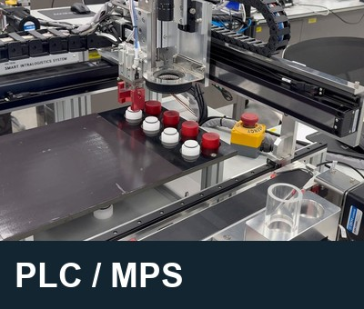
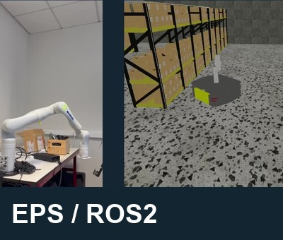
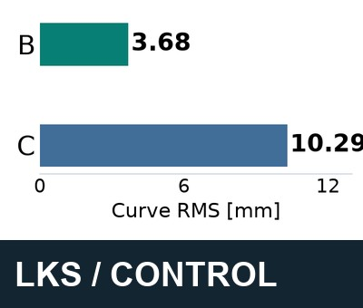

# 최효준 | Hyojun Choi

**Mechanical Engineering · KOREATECH**

PLC로 실물 설비를 제어하고 ROS2로 로봇 인터페이스를 연동했습니다. MATLAB/Simulink 프로젝트에서는 제어 결과를 분석했습니다. 기구설계에서는 3D 출력물을 조립한 뒤 치수를 직접 재고 동작을 살펴보며 형상과 조립 조건을 수정했습니다.

- **[PLC · MPS 자동 적재](projects/PLC-MPS-Automation/README.md)** — 개인 프로젝트. 각 동작의 완료 조건에 맞춰 시퀀스를 다시 구성했습니다. 실물 설비에서 순차·지그재그 방식으로 각각 8개를 적재했고, 중단 후에도 기존 상태를 유지한 채 작업을 재개했습니다.
- **[EPS · ROS2 로봇 인터페이스 연결](projects/eps-mirror-node/README.md)** — 5인 국제팀에서 ROS2 환경을 구성하고 Kinova 궤적의 변환·분배를 담당했습니다. 메시지 안의 관절명을 각 환경에 맞춰 바꾼 뒤, Gazebo 결합 모델과 실물 Kinova 팔에서 계획한 궤적이 실행되는지 검증했습니다.
- **[LKS · 제어 구조 비교](projects/LKS-Control-Optimization/README.md)** — 추종오차와 조향 입력을 함께 비교한 개인 시뮬레이션 프로젝트입니다. 적분항을 추가했을 때 곡선 구간의 추종오차가 오히려 더 커졌습니다.

ENIT European Project Semester (2025.09–12) · DGIST 하계 연구인턴 (2026.07)

English overview

I study mechanical engineering at KOREATECH. I worked on PLC sequences for a physical training MPS, ROS2 interfaces for a Kinova arm in a five-person EPS team, and steering-control analysis in MATLAB/Simulink. During my DGIST internship, I designed parts, assembled printed parts and checked how they worked.

Each project briefly explains what I worked on, what I changed, and what I checked. A short English overview is included with the Korean text.

