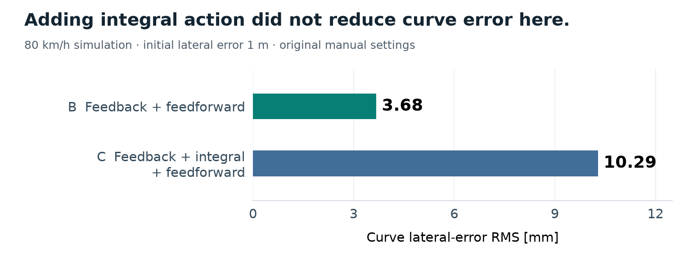
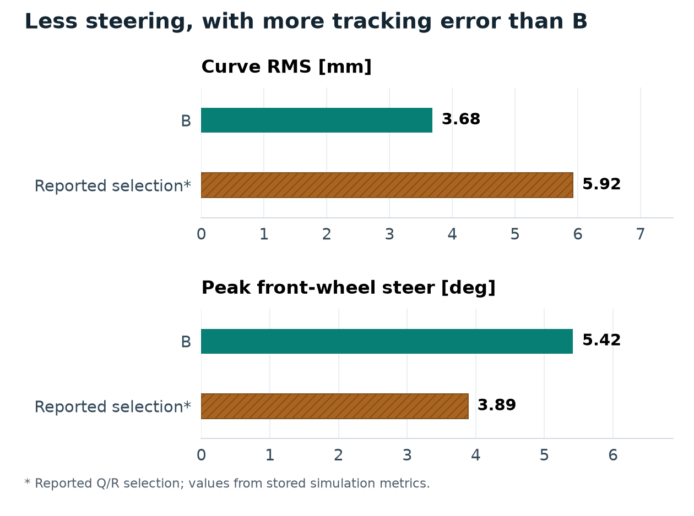

# LKS · 제어 구조 비교

차선유지 제어기에서 **추종오차와 조향 입력의 관계**를 비교한 MATLAB/Simulink 프로젝트입니다.

**개인 과제 · 2026년 1학기 · 차량 모델 시뮬레이션** · LQR / MATLAB·Simulink / Python

- **담당:** A/B/C 제어 구조를 구성하고, Q/R과 8개 평가 지표를 정해 결과를 비교·해석했습니다.
- **문제 → 판단:** 적분항을 추가한 C의 결과가 B보다 좋을 것으로 예상했지만, 같은 조건에서 비교한 결과는 달랐습니다.
- **비교 결과:** 곡선 RMS는 **B 3.68 mm / C 10.29 mm**로 B가 더 작았습니다.

[비교 CSV](data/reported_metrics.csv) · [판단과 평가식](docs/analysis.md) · [재계산](#직접-확인하기) · [English](#english-overview)

<picture>
  <source media="(max-width: 600px)" srcset="figures/structure-comparison-mobile.png">
  
</picture>

## 무엇을 비교했는가

| 구조 | 구성 | 곡선 RMS | 평가 J |
| --- | --- | ---: | ---: |
| A | 상태 피드백 + 적분 | 203.60 mm | 1385.110 |
| B | 상태 피드백 + 곡률 앞먹임 | **3.68 mm** | **0.682** |
| C | 상태 피드백 + 적분 + 곡률 앞먹임 | 10.29 mm | 5.662 |

**80 km/h 정속, 초기 횡오차 1 m** 조건에서 비교했으며, 곡선 평가 구간은 35~56.1 s입니다. 처음 수동으로 정한 설정에서는 B의 RMS와 J가 C보다 작았습니다. 지속적인 측풍이나 모델 불일치가 있는 조건은 비교하지 않았으므로, 이 결과만으로 적분 제어가 필요 없다고 보기는 어렵습니다. [당시 시간응답](figures/abc_curve_error.png)

## 판단 기준: 오차와 조향을 함께 보기

Q/R로 오차와 입력의 비중을 조절할 수 있어 LQR을 선택했습니다. 추종성·조향·차량 응답에 관한 **8개 지표를 정규화해 평가값 J를 계산하고**, 이를 기준으로 결과를 비교했습니다. 이 J는 LQR의 설계 비용과는 별도로 계산한 값입니다.

보고서의 Q/R 선택값을 적용하면 B와 비교해 최대 조향각이 **5.42° → 3.89°**로 줄어드는 대신, 곡선 RMS는 **3.68 → 5.92 mm**로 커집니다. J=0.559로 낮아졌지만 모든 지표가 좋아진 것은 아닙니다.

<details>
<summary>보고서 선택값과 B의 trade-off 보기</summary>



저장된 시뮬레이션 지표를 보고서의 선택값과 대조해 그렸습니다. 추종오차와 조향 입력이 각각 얼마나 달라졌는지 볼 수 있습니다.

</details>

**당시 탐색 과정:** 5,000개 시뮬레이션 결과로 Random Forest를 학습했습니다. 이 모델로 20,000개 Q/R 후보의 평가값 J를 예측한 뒤 상위 20개 후보를 Simulink에서 다시 실행했습니다. Random Forest는 **후보를 추리는 대리모델**로 사용했으며, 최종 조합은 다시 실행한 시뮬레이션 결과를 보고 정했습니다. 이 과정은 당시 보고서와 경험 기록에 정리했습니다. [평가식·후보 탐색](docs/analysis.md)

**이 저장소에서 볼 수 있는 자료:** 저장된 결과값 4행으로 J를 다시 계산하고 그래프를 그릴 수 있습니다. 당시의 전체 탐색 과정을 다시 실행하는 데 필요한 환경은 포함하지 않았습니다. [실행 방법과 필요한 환경](docs/reproducibility.md)

## 직접 확인하기

portfolio 저장소 루트에서:

```sh
cd projects/LKS-Control-Optimization
python tools/verify_metrics.py
```

CSV 4행에서 J를 다시 계산합니다. Python 표준 라이브러리만 필요하며, Simulink를 실행하지는 않습니다.

[원본 정밀도의 CSV](data/reported_metrics.csv) → [단위·지표 정의](data/README.md) → [재계산 코드](tools/verify_metrics.py)

그래프는 저장된 수치로 다시 그렸으며, 실차 시험은 하지 않았습니다. 수업 모델과 원본 코드는 작성자와 재배포 조건을 더 확인해야 하므로 공개하지 않았습니다. 대신 결과값과 J 재계산 도구를 정리했습니다.

## English overview

<details>
<summary>LQR structures, evaluation criteria and a steering/tracking trade-off</summary>

This was an individual MATLAB/Simulink project at 80 km/h with an initial lateral error of 1 m. I set up three control structures, chose Q/R and eight evaluation metrics, and compared the results.

With the original manual settings, feedback plus curvature feedforward (B) had a lower curve RMS than the same structure with integral action (C): 3.68 vs 10.29 mm. The Q/R choice in the report reduced peak steering from B's 5.42° to 3.89°, but curve RMS increased to 5.92 mm. A lower J did not mean every metric improved.

I trained a Random Forest surrogate with 5,000 simulation results and used it to predict J for 20,000 Q/R candidates. I then reran the top 20 in Simulink. The model helped narrow the search, and I chose the final combination from the simulation results. This process is recorded in the report and my project notes.

You can recalculate J from four stored result rows and redraw the plots. The files needed to repeat the full original search are not included. All results came from model simulations; I did not test the controller on a vehicle.

</details>

[자료 출처와 도구 설명](SOURCES.md) · [다른 프로젝트](../../README.md)
