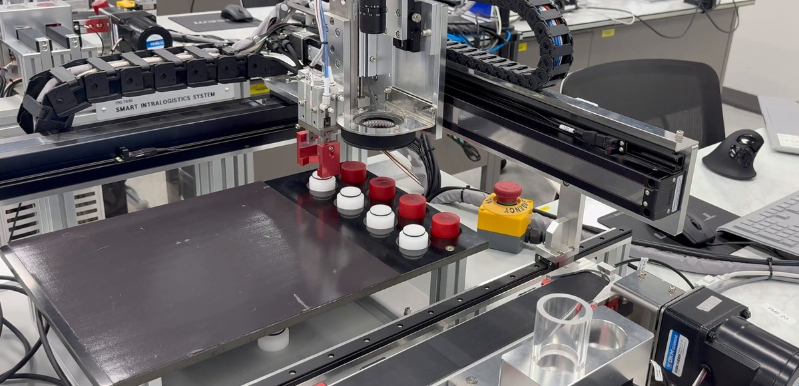
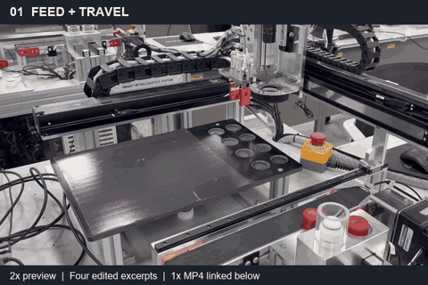

# PLC · MPS 자동 적재

공급 → 컨베이어 이송 → Pick → 적재를 연결한 **교육용 실물 MPS 제어 프로젝트**입니다.

**개인 과제 · 2026년 1학기** · Mitsubishi Q Series / 2축 서보 / GX Works2 / GP-Pro EX

- **담당:** 자동·수동 시퀀스, 위치결정, HMI 6화면, 오류 표시와 재개 흐름.
- **문제 → 변경:** 8번째 적재 실패 지점을 찾기 어려웠던 구조를 STEP·완료조건 중심으로 다시 구성했습니다.
- **확인:** 순차·지그재그 각 8개 적재, 중단 후 수량·인덱스를 유지한 재개.

[13초 동작 미리보기](#demo) · [제어 구조](docs/control-design.md) · [결과와 영상](docs/results.md) · [English](#english-overview)

## 동작 보기

**공급과 이동 → Pick → Place → 최종 적재** 순서로 보세요. 4개 핵심 구간을 연결한 13초·2배속 미리보기입니다.

[원속도 MP4 · 46초 · 무음](assets/process-demo-1x.mp4) · [정지 화면](assets/process-poster.jpg) · [구간별로 볼 부분](docs/results.md#영상-읽기)

MP4가 GitHub에서 재생되지 않으면 다운로드해 볼 수 있습니다. 필요한 구간만 잘라 연결한 영상이라 순차·지그재그 적재와 Resume의 전체 과정이 모두 담겨 있지는 않습니다. 해당 내용은 아래 제어 기록에 정리했습니다.

## 무엇을 바꿨는가

**1. 실패 위치를 찾을 수 있는 시퀀스**

타이머 중심으로 이어붙인 공정을 STEP 릴레이와 완료비트로 나눴습니다. 현재 STEP을 D300으로 함께 표시하고, D320 오류 코드와 HMI 진단 화면으로 정지 위치를 확인하도록 했습니다.

**2. 간섭하지 않는 두 동작만 중첩**

STEP30에서 공급과 POS_PICK 이동을 겹쳤습니다. Pick은 **공급 완료 + 컨베이어 안정화 + 서보 이동 완료**를 모두 확인한 뒤 시작합니다. [STEP별 완료조건과 Busy Seen 수정](docs/control-design.md)

**3. Reset과 Resume 분리**

전체 초기화와 상태 유지 재개를 나눴습니다. 중단 후에는 완료 수량과 다음 적재 위치를 보존하고, HMI 수동운전으로 장비·공작물 상태를 확인·조정한 뒤 자동운전을 이어갔습니다.

## 결과와 기술 자료

8개 적재와 재개 과정을 최종 보고서와 수행 기록에 남겼습니다. 보고서의 **12:00 → 10:25**는 수업 장비에서 기록한 값이며 양산 성과로 보기는 어렵습니다. [시간 기록과 측정 조건](docs/results.md)에 자세히 적었습니다.

| 읽고 싶은 내용 | 자료 |
| --- | --- |
| STEP, 위치 테이블, 부분 병렬화, 재개 조건 | [제어 설계](docs/control-design.md) |
| 시연 구간, 적재 패턴, 결과 기록 | [결과와 영상](docs/results.md) |
| 장비·개발 환경, 저장소에 담은 자료 | [사용 환경과 자료](docs/environment.md) |

X2는 소프트웨어에서 새 공정 명령을 막습니다. 이동 중 서보의 감속 정지나 하드웨어 안전 기능은 확인하지 않았습니다. 일부 자동 전이에는 내부 비트와 타이머를 썼습니다.

## English overview

Physical MPS sequencing, partial parallelization and restart behavior

An individual coursework project controlling an educational MPS from feeding to an eight-part stack. I worked on automatic/manual sequences, servo positioning, six HMI screens, diagnostics and restart behavior.

When the eighth part failed to reach its position, I could not easily find which step had caused the problem. I rebuilt the sequence around steps and completion conditions. I ran feeding and travel to the pick position together, then waited for feeding, conveyor stabilization and servo travel to finish before picking. I separated Reset from Resume. Resume kept the completed count and stack index, with operator checks and manual repositioning before restart.

I checked sequential and zigzag eight-part stacking and restart on the physical training machine. The demo shows four labeled excerpts, and the MP4 keeps the original speed. The report includes a timing comparison, but I could not check the original timing records or repeat conditions. These classroom results do not show production-line performance. X2 blocks new commands in software; I did not test servo deceleration or hardware safety functions.

[자료 출처와 작성 내용](SOURCES.md) · [다른 프로젝트](../../README.md)
