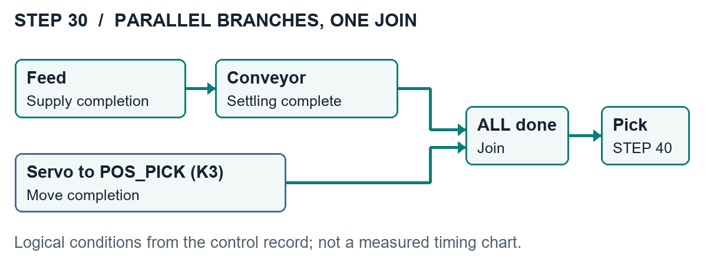

# 공정 제어와 수정 판단

## 완료조건을 기준으로 나누기

두 분기는 동작을 중첩한 범위이며, 선의 길이는 시간을 나타내지 않습니다. 합류 조건은 공급 완료·이송 안정화·서보 이동 완료입니다.

| STEP | 동작 | 다음 단계의 기준 |
| --- | --- | --- |
| 0 | 자동 대기 | 목표 1~8개와 Start |
| 10 | 초기 자세 | Home Done, Busy OFF, Error/Limit 정상, 상승 자세 |
| 20 | R/W 선택 | R 우선, 목표 달성 여부 |
| 30 | 공급·컨베이어와 POS_PICK | 공급 완료 + 이송 안정화 + K3 이동 완료 |
| 40 | Pick | 하강·그리퍼 CLOSE·상승의 완료 판정 |
| 50 | 적재 위치 이동 | D310이 가리키는 Position Table 이동 |
| 60 | Place | 그리퍼 OPEN 후 완료 수량 반영 |
| 70/80 | 반복 판단 | 수량·적재 인덱스·다음 위치 |
| 100 | 생산 완료 | 출력 정리·완료 표시 |

STEP 릴레이와 표시용 D300을 함께 갱신합니다. 공급과 POS_PICK은 실물에서 서로 간섭하지 않는 범위만 겹쳤습니다. Pick으로 넘어가는 시점에는 세 완료조건을 모두 확인합니다. 모든 동작의 병렬화가 목적은 아니었습니다.

## 서보와 적재 위치

POS_PICK은 K3, 적재 위치는 K4~K11입니다. 순차는 K4부터 K11, 지그재그는 K8 → K5 → K10 → K7 → K4 → K9 → K6 → K11을 호출합니다. 보고서의 서보 속도 설정은 500 mm/min입니다.

위치 번호 설정 → Start → Busy 관찰 → Busy OFF·안정화 확인의 흐름을 사용했습니다. 실물에서는 Busy 펄스가 짧아 초안의 K18/K19 Timeout이 정상 동작을 오류로 잡았습니다. 최종 기록은 Busy Seen과 T14/T15 안정화 타이머로의 변경을 설명합니다. 초안 에러 목록이 찍힌 HMI 사진을 최종 기능의 증거로 사용하지 않았습니다.

## Reset과 Resume

| 입력 | 유지·변경하는 상태 | 작업자의 확인 |
| --- | --- | --- |
| X2 중단 | 자동 운전 래치·신규 출력 명령 해제, 완료 수량·D310·D361 유지 | 장비와 공작물 위치 확인 |
| Reset | 전체 상태 초기화 | 처음부터 시작할 수 있는 장비 상태 |
| Start/Resume | 완료 수량·적재 인덱스를 보존한 재개 | 수동운전으로 실제 자세를 맞춘 뒤 재개 |

HMI는 Auto, Process, Manual 1/2, Servo, Monitor의 6화면입니다. D220은 진행률, D300은 STEP, D310은 다음 적재 위치, D361은 인덱스, D320은 에러 코드, D402는 공정 애니메이션 표시를 담당합니다.

## 확인 범위

센서는 HMI 모니터링과 수동 점검에 활용했지만, 일부 자동 전이는 내부 비트와 타이머에 의존합니다. 공압 저하나 공작물 걸림을 모두 분리 시험한 자료는 없습니다. X2가 이동 중 축의 감속 정지까지 보장하는 구조도 아닙니다.

[프로젝트로 돌아가기](../README.md)
