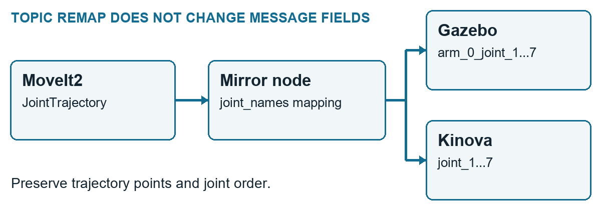

# EPS · ROS2 궤적 연결

Ridgeback + Kinova 프로젝트에서 **계획 궤적을 Gazebo와 실물 Kinova의 인터페이스에 맞게 연결**했습니다.

**5인 국제팀 · ENIT, France · 2025.09–12** · ROS2 Jazzy / MoveIt2 / Gazebo / Python

- **담당:** Kinova 제어, ROS2 환경·결합 모델 구성, 궤적 변환·분배, 실행 절차 정리.
- **문제 → 판단:** 토픽 remap만으로 해결되지 않는 관절명 차이를 메시지 내부에서 변환했습니다.
- **확인:** 결합 Gazebo 모델과 실물 Kinova 팔의 동작.

[16초 데모](#demo) · [변환 코드](src/eps_mirror/routing.py) · [설치·실행](docs/running.md) · [English](docs/README_EN.md)


## 동작과 메시지 연결

<a name="demo"></a>

**왼쪽은 실물 Kinova, 오른쪽은 Gazebo 결합 모델**입니다. 기존 데모와 같은 시퀀스의 16초를 발췌하고, 두 팔이 보이도록 화면을 확대했습니다.

[](assets/kinova-demo-1x.mp4)

[MP4 · 16초 · 원본 편집 속도 · 무음](assets/kinova-demo-1x.mp4) · [정지 화면](assets/kinova-overview.jpg)

두 화면은 편집본이며 공통 시각 기준이 없습니다. 동시 실행·동기화 오차·통신지연을 측정한 영상은 아닙니다. MP4 링크는 GitHub 파일 화면에서 열리며, 재생이 안 되면 다운로드할 수 있습니다.



토픽 이름과 메시지 필드를 나눠 확인했습니다. `DisplayTrajectory`에서 첫 `JointTrajectory`를 꺼내고, 관절 순서·궤적 점을 유지하며 목적지에 맞는 접두어를 적용했습니다. [메시지 규칙과 실패 입력 검사](src/eps_mirror/routing.py)

## 내 담당과 팀의 범위

| 구분 | 수행 내용 |
| --- | --- |
| 본인 | 환경 구성, Kinova 명령·실행 확인, 결합 시뮬레이션, 변환·분배 노드, Setup Guide |
| 팀 | 모바일 매니퓰레이터 요구사항·시나리오, 프로젝트 관리·공동 보고서, 통합 방향 |
| 팀원 제안 | `/display_planned_path`를 궤적 입력으로 활용 |
| AI 활용 | 코드 초안 생성에 활용. 본인은 구조·인터페이스를 검토하고 실행 결과를 대조·수정 |

Rolling에서 사용한 Clearpath 구성의 크래시를 근거로 Jazzy 전환을 제안했습니다. 결합 모델은 구성요소를 하나씩 빼고 넣어 안정 설정을 찾았습니다. [환경 선택과 문제 분리 과정](docs/engineering-notes.md)

물리 Ridgeback의 배터리 문제로 **전체 실물 통합은 완료하지 못했습니다.** 검증 대상을 결합 Gazebo 모델과 실물 Kinova 단독으로 조정했고, LiDAR 플러그인 문제도 남았습니다. [당시 확인 범위](docs/results.md)

## 코드로 더 보기

1. [routing.py](src/eps_mirror/routing.py): 관절명·배열 길이·시간 값 검사와 변환.
2. [mirror_node.py](src/eps_mirror/mirror_node.py): ROS2 입출력과 simulation/real 발행 분기.
3. [running.md](docs/running.md): 설치와 simulation-only 기본 실행.

portfolio 저장소 루트에서:

```sh
cd projects/eps-mirror-node
python -m unittest discover -s tests -v
```

현재 코드는 **2026-09 공개 준비 유지보수본**입니다. 패키징·입력 검사·실물 출력 기본 비활성화와 테스트를 추가했습니다. Python 계층은 검사했으며 ROS2·실물 재시험은 하지 않았습니다. 당시 실행과 후속 수정은 [변경 범위](docs/maintenance.md)에서 구분합니다.

[당시 코드와 이력](https://github.com/CHOI-HYOJUN-kr/eps-mirror-node) · [출처·MIT 적용 범위](SOURCES.md) · [다른 프로젝트](../../README.md)
