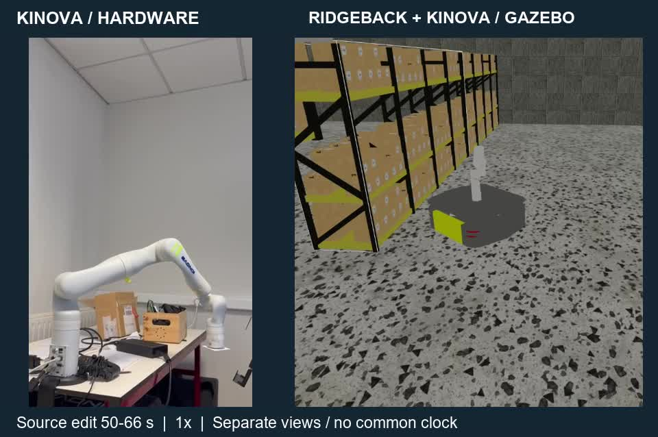

# EPS trajectory routing

During the Fall 2025 EPS at ENIT, our five-person Team BOB worked on a Ridgeback–Kinova mobile manipulator. I handled the Kinova-side environment, topic/message analysis, simulation integration, trajectory routing, and setup documentation.

[16-second MP4 excerpt](../assets/kinova-demo-1x.mp4). The views are cropped from the source edit; they are not timestamp-aligned measurements.

A teammate proposed using MoveIt's display topic. I reviewed the interfaces, used AI to draft the code, then checked and revised it against execution. The router extracts the first JointTrajectory and adapts `joint_*` / `arm_0_joint_*` names without reordering the trajectory.

The combined Gazebo model and the physical Kinova arm were demonstrated. The physical Ridgeback scenario remained incomplete because of its battery problem. Latency and synchronization error were not measured.

The September 2026 maintenance adds packaging, input validation, tests, and explicit output opt-in. These are portfolio maintenance changes, not claims about the original semester implementation. ROS2/hardware integration has not been rerun in this maintenance environment.

[Main README](../README.md) · [Running](running.md) · [Source and attribution](../SOURCES.md)
