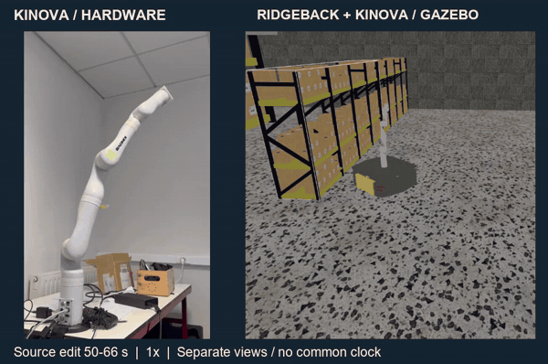

# 결과와 데모 읽기

## 화면에서 볼 부분

데모 왼쪽은 **실물 Kinova Gen3 팔**, 오른쪽은 **Ridgeback + Kinova Gazebo 결합 모델**입니다. 기존 공개 GIF와 같은 동작 시퀀스를 원본 편집 영상의 50–66초에서 발췌했습니다. 작은 팔이 보이도록 두 화면을 각각 크롭·확대했습니다.

[MP4 · 16초 · 원본 편집 속도](../assets/kinova-demo-1x.mp4)

GIF도 원본 편집 영상 기준 1배속입니다. 원본은 이미 두 화면을 합친 편집본이므로, 이것을 각 장비의 원시 타임스탬프나 공통 시각 기준으로 취급하지 않습니다. 동시 실행·지연·동기화 오차는 측정하지 않았습니다. 미디어의 배치와 별개로 기술 설명의 핵심은 메시지 구조를 목적지 controller에 맞게 변환한 과정입니다.

## 당시 확인 범위

| 항목 | 당시 확인 범위 | 남은 조건 |
| --- | --- | --- |
| Ridgeback + Kinova Gazebo 모델 | 결합 모델의 동작 | LiDAR 기반 자율주행 성능 미확인 |
| 실물 Kinova Gen3 | 팔 단독 명령·동작 확인 | 실물 모바일 베이스와 결합하지 못함 |
| 계획 궤적 변환·분배 | 코드, 실행 기록과 데모 | 지연·동기화 계측 없음 |
| 실행 절차·Setup Guide | 팀 인수인계 자료 작성 | 의존 패키지의 정확한 commit pin 없음 |
| 실물 Ridgeback 통합 | 미완료 | 배터리 문제로 범위 조정 |

팀 보고서의 synchronized 표현을 정량 동기화 검증으로 옮기지 않았습니다. 2026-09 유지보수의 Python 로직·발행 분기 검사는 [maintenance](maintenance.md)에 구분했습니다. ROS2 Jazzy, Gazebo, Kortex와 실제 장비의 종단 간 재시험은 별도입니다.

[프로젝트로 돌아가기](../README.md)
